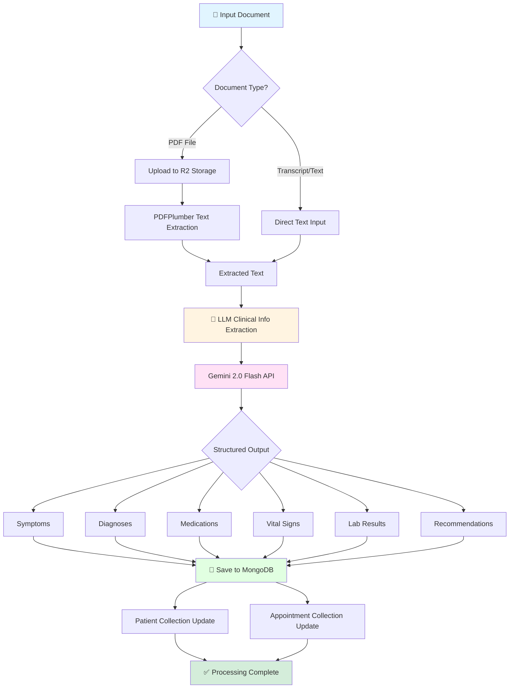
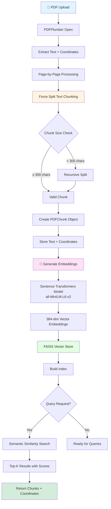
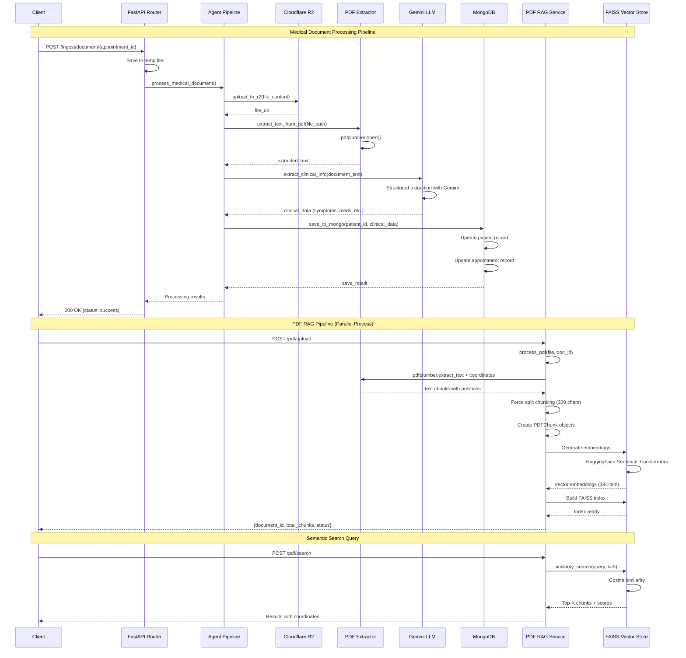

# MedAI

**AI-Powered Healthcare Management System** built for Inter-IIIT Final Round

MedAI is a comprehensive healthcare platform that leverages AI to enhance doctor-patient interactions, automate clinical workflows, and provide intelligent health insights. The system features dual portals for doctors and patients, with real-time multilingual support and advanced medical AI capabilities.

## Key Features & Capabilities

### 🤖 AI-Powered Features (Fully Functional)

#### 1. **Intelligent Diagnosis Generation**
- Analyzes comprehensive patient data including medical history, test results, and appointment records
- Uses **Med42** (medical LLM via Featherless AI) to generate clinical diagnoses
- Structured output with differential diagnoses, confidence scores, and clinical reasoning
- Integrates LSTM-based time series predictions for health metrics
- Context compression using Gemini for efficient processing

#### 2. **Multilingual Patient Chatbot**
- Supports **12 languages**: Hindi, Tamil, Telugu, Bengali, Gujarati, Kannada, Malayalam, Marathi, Odia, Punjabi, English, and more
- Real-time text and voice interaction (STT + TTS via Sarvam AI)
- Context-aware responses using patient medical history and appointment data
- Intent detection for medication queries, diet recommendations, and appointment scheduling
- Markdown-formatted responses with audio playback

#### 3. **Medical Transcription & Speech Processing**
- Real-time speech-to-text for doctor-patient consultations
- Streaming transcription with Sarvam AI
- Multi-language support for consultations
- Automatic clinical note generation from conversations

#### 4. **Document Intelligence (RAG)**
- PDF analysis with semantic search using FAISS vector database
- Extracts insights from medical reports, lab results, and clinical documents
- Sentence transformer embeddings for accurate retrieval
- Question-answering over uploaded medical documents

#### 5. **Time Series Health Analytics**
- LSTM-based prediction for vital signs and lab metrics (Blood Pressure, Heart Rate, Glucose, etc.)
- Trend analysis across multiple appointments
- Early warning system for deteriorating health metrics
- Visual dashboards for health trajectory

### 🏥 Doctor Portal (Fully Functional)

- **Patient Management**: Search, view, and manage patient records
- **Appointment Scheduling**: Create and track appointments with real-time status updates
- **Active Sessions**: Conduct consultations with live audio transcription
- **AI Diagnosis Assistant**: Generate AI-powered diagnostic suggestions during consultations
- **Clinical Insights**: View time series predictions and health trends
- **Document Upload**: Upload and analyze medical reports with RAG
- **Test Results Management**: Track lab results over time with visualizations
- **PDF Viewer**: Integrated document viewer for medical reports

### 👤 Patient Portal (Mixed: Backend + Frontend Dummy)

**Fully Functional:**
- **AI Chatbot**: Multilingual health assistant with voice support
- **Appointment Booking**: Schedule appointments with doctors
- **Medical History**: View past appointments and diagnoses

**Using Dummy Data (Frontend Only):**
- **Medications Display**: Shows sample medication schedules
- **Diet Plans**: Displays example diet recommendations
- **Test Results Charts**: Visualizations using sample data
- **Notifications**: Mock appointment reminders

### 🔐 Authentication & Security

- JWT-based authentication with HTTPBearer scheme
- Argon2 password hashing
- 7-day access token expiration
- Protected routes for both portals
- Separate signup flows for doctors and patients

### 💾 Data Storage

- **MongoDB**: User accounts, appointments, patient records, clinical data
- **Cloudflare R2**: Medical documents, audio files, images
- **FAISS (In-Memory)**: Vector embeddings for document search

## Document Ingestion Architecture

MedAI implements two sophisticated document processing pipelines to handle medical documents and enable intelligent search capabilities.

### Pipeline 1: Medical Document Processing

This pipeline extracts structured clinical information from medical documents (PDFs, transcripts, text) and stores them in MongoDB for retrieval.



### Pipeline 2: PDF RAG (Retrieval-Augmented Generation)

This pipeline creates semantic embeddings for intelligent document search and question-answering.



### Sequence Diagram: Complete Document Ingestion Flow



### Key Technical Details

#### Medical Document Processing
- **Text Extraction**: PDFPlumber for PDF parsing, PyPDF2 as fallback
- **Clinical Information Extraction**: Gemini 2.0 Flash with structured output schema
- **Storage**: MongoDB collections updated with extracted medical data
- **Cloud Storage**: R2 for original document files

#### PDF RAG System
- **Chunking Strategy**: Target 300 characters per chunk with 50-char overlap
- **Coordinate Tracking**: X/Y coordinates stored for PDF highlight annotations
- **Embedding Model**: sentence-transformers/all-MiniLM-L6-v2 (384 dimensions)
- **Vector Store**: FAISS with in-memory indexing for fast similarity search
- **Search**: Cosine similarity-based semantic search returning top-K results with scores

## Tech Stack

### Frontend
- **React 18** with React Router v6
- **Tailwind CSS** for styling
- **Framer Motion** for animations
- **Recharts** for data visualization
- **Lucide React** for icons
- **React Markdown** for rich text display
- **PDF.js** for document rendering
- **Vite** as build tool

### Backend
- **FastAPI** (Python 3.11+) for REST API
- **LangChain** for LLM orchestration
- **Google Generative AI (Gemini)** for structured outputs
- **Featherless AI (Med42)** for medical diagnosis
- **Sarvam AI** for multilingual STT/TTS
- **FAISS + Sentence Transformers** for vector search
- **PyMongo** for MongoDB integration
- **Boto3** for R2 cloud storage
- **PyJWT** for authentication
- **PDFPlumber** for PDF extraction
- **Pydub** for audio processing

## Project Structure

```
project root/ (MedAI)
├── frontend/               # React application
│   ├── src/
│   │   ├── components/
│   │   │   ├── doctor/    # Doctor portal UI
│   │   │   └── patient/   # Patient portal UI
│   │   ├── pages/         # Route pages
│   │   ├── contexts/      # React contexts (Auth, DarkMode)
│   │   ├── data/          # Dummy data (medications, diet)
│   │   └── utils/         # Helper functions
│   └── package.json
│
├── backend/               # FastAPI service
│   ├── src/
│   │   ├── routes/        # API endpoints
│   │   ├── services/      # Core AI/business logic
│   │   │   ├── diagnosis_generator.py    # AI diagnosis
│   │   │   ├── multilingual_chatbot.py   # Patient chatbot
│   │   │   ├── streaming_stt.py          # Speech-to-text
│   │   │   ├── pdf_rag.py                # Document RAG
│   │   │   ├── timeseries_predictor.py   # LSTM predictions
│   │   │   └── tools.py                  # LLM agent tools
│   │   ├── models/        # Pydantic schemas
│   │   ├── llm/           # LLM providers (Gemini, Featherless)
│   │   ├── middlewares/   # JWT auth
│   │   └── utils/         # PDF extraction, helpers
│   ├── requirements.txt
│   └── .env.example
│
└── README.md
```

## What Works vs What's Dummy

### ✅ Fully Functional (Backend + Frontend Integration)

| Feature | Status | Details |
|---------|--------|---------|
| User Authentication | ✅ Working | JWT-based, Argon2 hashing |
| AI Diagnosis Generation | ✅ Working | Med42 + Gemini, context-aware |
| Multilingual Chatbot | ✅ Working | 12 languages, STT/TTS, RAG-enabled |
| Speech Transcription | ✅ Working | Sarvam AI, streaming support |
| Document RAG | ✅ Working | FAISS vector search on PDFs |
| Time Series Prediction | ✅ Working | LSTM for health metrics |
| Appointment Management | ✅ Working | Full CRUD, status tracking |
| Patient Records | ✅ Working | MongoDB storage, history |
| File Upload/Storage | ✅ Working | R2 cloud storage |
| PDF Viewer | ✅ Working | Integrated document viewer |
| Dark Mode | ✅ Working | System-wide theme toggle |

### 🎨 Frontend Dummy Data (UI Only, No Backend)

| Feature | Status | Note |
|---------|--------|------|
| Medications Display | 🎨 Dummy | Uses `dummyData.js` for sample meds |
| Diet Plans | 🎨 Dummy | Frontend mock data |
| Test Results Charts | 🎨 Partial | Uses sample time series data for visualization |
| Notifications | 🎨 Dummy | Mock appointment reminders |
| Some Appointment Cards | 🎨 Mixed | Uses `appointmentData.js` for demos |

## Getting Started

### Prerequisites
- **Node.js 18+** and npm
- **Python 3.11+**
- **MongoDB** instance
- **Cloudflare R2** bucket (or AWS S3)
- API keys for: Gemini, Featherless AI, Sarvam AI

### Installation

#### 1. Clone Repository
```bash
git clone <repository-url>
cd Inter-IIIT-Round2
```

#### 2. Frontend Setup
```bash
cd frontend
npm install
npm run dev  # Runs on http://localhost:5173
```

#### 3. Backend Setup
```bash
cd backend

# Create virtual environment (recommended)
python -m venv venv
source venv/bin/activate  # On Windows: venv\Scripts\activate

# Install dependencies
pip install -r requirements.txt

# Configure environment variables
cp .env.example .env
# Edit .env with your credentials

# Run server
uvicorn src.server:app --reload --port 8000
```

#### 4. Environment Variables
Create `backend/.env`:
```env
MONGODB_URI=mongodb://localhost:27017/medai
GEMINI_API_KEY=your_gemini_key
FEATHERLESS_API_KEY=your_featherless_key
SARVAM_AI_API_KEY=your_sarvam_key
R2_ENDPOINT=https://your-account-id.r2.cloudflarestorage.com
R2_ACCESS_KEY=your_r2_access_key
R2_SECRET_KEY=your_r2_secret_key
R2_BUCKET=medai
R2_PUBLIC_URL=https://your-public-url.com
SECRET_KEY=your_jwt_secret_key_here
PORT=8000
```

### API Documentation
Once backend is running, visit:
- **Swagger UI**: http://localhost:8000/docs
- **ReDoc**: http://localhost:8000/redoc

## API Endpoints

### Authentication
- `POST /auth/signup` - Register new user (doctor/patient)
- `POST /auth/login` - Login and get JWT token
- `GET /auth/me` - Get current user profile

### Patients
- `GET /patients/` - List all patients (doctor only)
- `GET /patients/{id}` - Get patient details
- `POST /patients/` - Create patient record

### Appointments
- `POST /appointments/` - Create appointment
- `GET /appointments/` - List appointments
- `PATCH /appointments/{id}` - Update appointment status

### AI Features
- `POST /chatbot/text` - Text-based multilingual chat
- `POST /chatbot/audio` - Voice-based chat with STT/TTS
- `POST /doctor/generate-diagnosis` - AI diagnosis generation
- `POST /ingest/pdf` - Upload and analyze medical documents
- `POST /doctor/transcribe` - Real-time audio transcription

## Development Notes

### Adding Dummy Data to Backend Integration
To convert frontend dummy components to use real backend:

1. Create corresponding API endpoint in `backend/src/routes/`
2. Add data models in `backend/src/models/`
3. Update frontend component to fetch from API instead of importing `dummyData.js`
4. Add authentication headers to API calls

### AI Model Configuration
- **Diagnosis**: Uses Med42-70B via Featherless AI
- **Chatbot**: Uses Gemini 2.0 Flash for structured responses
- **Embeddings**: Uses `sentence-transformers/all-MiniLM-L6-v2`
- **STT/TTS**: Sarvam AI for Indic languages

### Performance Considerations
- FAISS vector database runs in-memory (rebuild on restart)
- LLM context compression to stay within token limits
- Streaming responses for real-time transcription
- MongoDB indexes on user_id and appointment_id

## Future Enhancements

- Integrate real medication management API
- Add diet plan generation using LLM
- Real-time notifications with WebSockets
- Doctor-patient video consultations
- Lab integration for automatic test result import
- Prescription generation and e-signing
- Health insurance claim processing
- Advanced analytics dashboard for doctors
